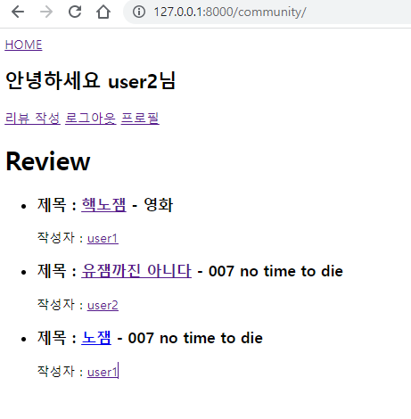
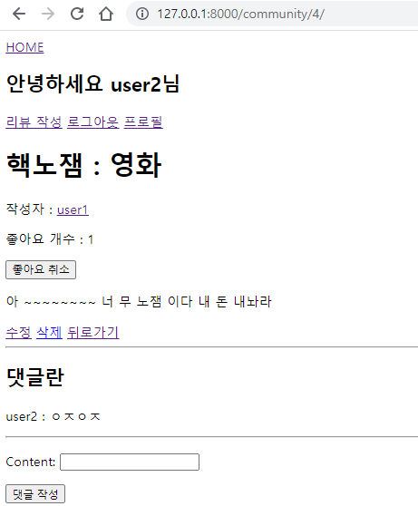
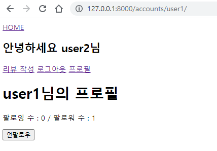

# PJT 07

## B. Model

```python
#accounts/models.py
from django.db import models
from django.contrib.auth.models import AbstractUser

# Create your models here.
class User(AbstractUser):
    last_name = models.CharField(max_length=150)
    first_name = models.CharField(max_length=150)
    followers = models.ManyToManyField('self', symmetrical=False, related_name='followings')
```

```python
from django.db import models
from django.conf import settings

# Create your models here.
from django.db import models
from django.db.models.fields import related

class Review(models.Model):
    user = models.ForeignKey(settings.AUTH_USER_MODEL, on_delete=models.CASCADE)
    title = models.CharField(max_length=100)
    movie_title = models.CharField(max_length=50)
    like_users = models.ManyToManyField(settings.AUTH_USER_MODEL, related_name="like_review")
    rank = models.IntegerField()
    content = models.TextField()
    created_at = models.DateTimeField(auto_now_add=True)
    updated_at = models.DateTimeField(auto_now=True)

class Comment(models.Model):
    content = models.CharField(max_length=100)
    review = models.ForeignKey(Review, on_delete=models.CASCADE)
    user = models.ForeignKey(settings.AUTH_USER_MODEL, on_delete=models.CASCADE)
```


## C. Form

```python
# accounts/forms.py

from django import forms
from django.contrib.auth import get_user_model
from django.contrib.auth.forms import UserCreationForm

User = get_user_model()

class CustomUserCreationForm(UserCreationForm):
    class Meta:
        model = User
        fields = ('username', 'email', 'last_name', 'first_name')
```

```python
# community/forms.py

from django import forms
from .models import Review, Comment

class ReviewForm(forms.ModelForm):
    class Meta:
        model = Review
        fields = ('title', 'movie_title', 'rank', 'content',)


class CommentForm(forms.ModelForm):
    class Meta:
        model = Comment
        fields = ('content',)
```


## D. URL

```python
# pjt07/urls.py
from django.contrib import admin
from django.urls import path, include

urlpatterns = [
    path('admin/', admin.site.urls),
    path('accounts/', include('accounts.urls')),
    path('community/', include('community.urls')),
]
```

```python
# accounts/urls.py

from django.urls import path
from . import views

app_name = 'accounts'

urlpatterns = [
    path('signup/', views.signup, name='signup'),
    path('login/', views.login, name='login'),
    path('logout/', views.logout, name='logout'),
    path('<str:username>/', views.profile, name='profile'),
    path('<str:username>/follow/', views.follow, name='follow'),
]
```

```python
# community/urls.py

from django.urls import path
from . import views

app_name = 'community'

urlpatterns = [

    path('create/', views.create_review, name='create'),
    path('', views.review_index, name='index'),
    path('<int:review_pk>/', views.review_detail, name='detail'),
    path('<int:review_pk>/update/', views.update_review, name='update'),
    path('<int:review_pk>/delete/', views.delete_review, name='delete'),
    path('<int:review_pk>/like/', views.like_review, name='like'),
    path('<int:review_pk>/comments/create/', views.create_comment, name='comment'),
]
```


## E. Views & Templates

### i. 공유 템플릿 생성 및 사용



```html
<!-- base.html -->
<!DOCTYPE html>
<html lang="en">
<head>
  <meta charset="UTF-8">
  <meta http-equiv="X-UA-Compatible" content="IE=edge">
  <meta name="viewport" content="width=device-width, initial-scale=1.0">
  <title>Document</title>
</head>
<body>
  
  
</body>
</html>
```

```html
<!-- _nav.html -->
<nav>
  <a href="">HOME</a>
  
    <h1>안녕하세요 {{ request.user.username }}님</h1>
    <a href="">리뷰 작성</a>
    <a href="">로그아웃</a>
    <a href="">프로필</a>
  
    <a href="">회원가입</a>
    <a href="">로그인</a>
  
</nav>
```


### ii. 리뷰 좋아요 기능



```python
# community/views.py
@login_required
@require_POST
def like_review(request, review_pk):
    review = get_object_or_404(Review, pk=review_pk)
    if review.like_users.filter(pk=request.user.pk).exists():
        review.like_users.remove(request.user)
    else:
        review.like_users.add(request.user)
    return redirect('community:detail', review.pk)
```

```html
<!-- community/detail.html -->


  <h1>{{ review.title }} : {{ review.movie_name }} </h1>
  
    <form action="" method="POST">
    
      <input type="submit" value="좋아요 취소">
    </form>
  
    <form action="" method="POST">
    
      <input type="submit" value="좋아요">
    </form>
  
  <p>좋아요 개수 : {{ review.like_users.all|length }}</p>
  <a href=""><p>{{ review.user.username }}</p></a>
  <p>{{ review.content }}</p>
  <a href="">수정</a>
  <a href="">삭제</a>
  <a href="">뒤로가기</a>

  <hr>
  <h2>댓글란</h2>
  
    <p>{{ comment.user }}</p>
    <p>{{ comment.content }}</p>
    <hr>
  
  <form action="" method="POST">
    
    {{ comment_form.as_p }}
    <input type="submit" value="댓글 작성">
  </form>


```


### iii. 유저 팔로우 기능



```python
# accounts/views.py
@require_safe
def profile(request, username):
    profile = get_object_or_404(User, username=username)

    context = {
        'profile': profile, 

    }
    return render(request, 'accounts/profile.html', context)

def follow(request, username):
    profile = get_object_or_404(get_user_model(), username=username)
    user = request.user
    if profile != user:
        if profile.followers.filter(pk=user.pk).exists():  
            profile.followers.remove(user)
        else:
            profile.followers.add(user)
    return redirect('accounts:profile', profile.username)
```

```html
<!-- accounts/profile -->


  <h1>{{ profile.username }}님의 프로필</h1>
  <p>팔로잉 수 : {{ profile.followings.all|length }} / 팔로워 수 : {{ profile.followers.all|length }}</p>
  
    
      <form action="">
      
      <input type="submit" value="언팔로우">
      </form>
    
      <form action="">
      
      <input type="submit" value="팔로우">
      </form>
    

  
  

```


## 후기

views가 길어지고 user와 review간의 n:m 관계를 가지는 요소들이 많아지다 보니 용어가 너무 헷갈렸다. 그래도 model의 schema를 미리 정하고 참조해서 오류가 발생했을 때 대처할 수 있었다. 

